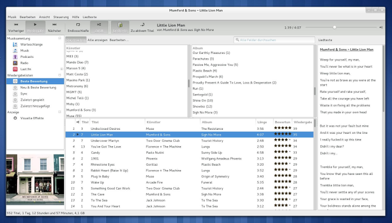

lLyrics
===============

lLyrics 是 [Rhythmbox](http://projects.gnome.org/rhythmbox/) 的插件，在侧边栏中显示当前播放歌曲的歌词。

它旨在取代 Rhythmbox 的内置歌词插件，提供更多功能、更好的UI集成和更多的歌词引擎。

歌词来源
---------------

  - 所在目录下同名.lrc(LocalSameFolder)（新增）
  - 酷狗音乐(Kugou.com)（新增）
  - 网易云音乐(music.163.com)（新增）
  - 酷我音乐(Kuwo.cn)（新增）
  - Letras.terra.com.br
  - AZLyrics.com
  - Lyricsmania.com
  - Vagalume.com.br
  - Darklyrics.com
  - Chartlyrics.com
  - Lyricwiki.org（移除）
  - Metrolyrics.com（移除）
  - Genius.com（移除）
  
也可以从内置的 Rhythmbox 歌词插件中检索歌词，但不建议这样做，因为它有一些错误，可能会导致不稳定。

要求
---------------

“master”分支支持 Rhythmbox 3.0及更高版本。**它与旧的 Rhythmbox 2.xx 版本不兼容！**

要从源代码安装 lLyrics，您将需要包 `gettext`。

#### 依赖项 ####

lLyrics 可以在不需要任何额外包的情况下运行，但建议安装 python 模块 **"chardet"**，以便更好地处理不同的编码。

安装
---------------

#### Ubuntu 及其衍生版: PPA ####

在基于 Ubuntu 的发行版中，您可以通过 [由 fossfreedom 提供的 PPA](https://launchpad.net/~fossfreedom/+archive/rhythmbox-plugins) 安装插件(原始分支)。

#### Archlinux: AUR ####

Archlinux 用户可以通过 [此 AUR 包](https://aur.archlinux.org/packages/rhythmbox-llyrics/) 安装插件(原始分支)。

#### 手动安装 ####

	1.) 点击“下载ZIP”按钮并解压.ZIP文件。

	2.) 打开终端，进入到提取的文件夹。

	3.) 运行 `make install`。

	4.) 在 Rhythmbox 中启用插件。

它会询问您的 sudo 密码，但别担心，它只需要安装保存您的首选项所需的模式文件。

如果要为所有用户在系统范围内安装插件，请在步骤3中运行 `make install-systemwide`。

若要卸载，请运行 `make uninstall`。

请注意，您需要 Rhythmbox 版本 3.0 或更高版本才能运行此分支版本的 lLyrics！

特征
---------------
  - 支持许多不同的歌词网站（见上文）
  - 集成到 Rhythmbox UI
  - 歌词来源可以优先排序和停用
  - 播放时自动显示歌词或仅按需显示
  - 将检索到的歌词保存为本地文件（可以停用）
  - 可以编辑歌词
  - 通过 Last.fm API更正艺术家/标题标签以获得更好的结果
  - 外观可定制，以适应您的需求或可用的屏幕空间
  - 对同步歌词的基本支持
  - 同步歌词的高亮时间精度提升到1/10秒（此分支新增）
  - 更多……

鸣谢
---------------

我(指原作者Timo Loewe)受到了很棒的 Songbird 插件 [MLyrics](https://github.com/FreeleX/MLyrics) 的启发。
感谢所有贡献、报告问题或以任何其他方式帮助改进此插件的人。

您将始终在[GitHub](https://github.com/dmo60/lLyrics)上找到（原始分支的）最新版本。
请在那里报告错误、问题或功能请求。

我们非常感谢翻译方面的帮助！

所有歌词均为其所有者的财产和版权。

